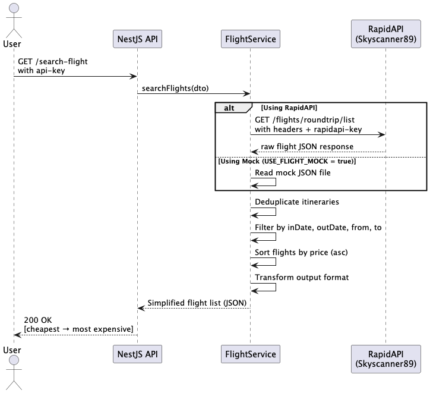

# ✈️ Flight Search API (NestJS + Skyscanner via RapidAPI)

A NestJS-based API to search roundtrip flights using Skyscanner (RapidAPI). 
- Search between any date range
- Sort by cheapest price
- Mock data response

### 🛠 Tech Stack

- **NestJS** - Backend framework
- **RapidAPI** – Skyscanner API
- **Swagger** (OpenAPI) - Basic Auth for Auto-generated docs


## ⚙️ Prerequisites

- Node.js **v20+**  
  _Recommended_: [`nvm`](https://github.com/nvm-sh/nvm)

```bash
nvm install 20
nvm use 20
```


## 🚀 Getting Started

```bash
git clone https://github.com/kychok98/pulsifi-assessment.git flight-search-api
cd flight-search-api
npm install        # or: yarn install
cp .env.example .env # update ENV
npm run start:dev  # or: yarn start:dev
```


### 🧪 Sample Request
```bash
curl -X GET "http://localhost:3000/api/v1/search-flight?from=JFK&to=HNL&inDate=2024-08-22&outDate=2024-08-25" \
-H "x-api-key: my-secret-key"
```


### 📘 Swagger Docs
- 🌐 URL: http://localhost:3000/docs
- 🔐 Basic Auth: `admin` / `admin`
- 🛡️ Use "Authorize" to enter your API key: `x-api-key: my-secret-key`


---

### 📊 Request-Response Flow (PlantUML)




## License

Nest is [MIT licensed](https://github.com/nestjs/nest/blob/master/LICENSE).

